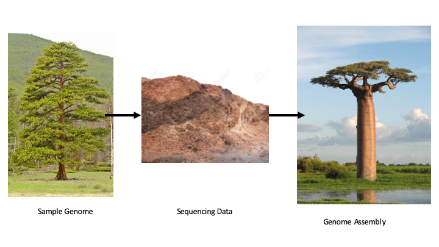

```{r setup, include=FALSE}
knitr::opts_chunk$set(echo = TRUE)
```


# Genome Assembly

Challenge: Assemble a 1 billion piece puzzle where the pieces are all made of only 4 colors and repeated shapes.

```{r echo=FALSE, out.width='100%', fig.align='center'}

```

## Setup

In late December of 2019 doctors and scientists in Wuhan, China were tracking down the cause of an unknown respiritory virus. One part of this effort was to sequence RNA from bronchealveolar fluid from one of the patients. Those data are now available for us to work with:

[Data from 9 samples sequenced on December 30, 2019](https://www.ncbi.nlm.nih.gov/sra?linkname=bioproject_sra_all&from_uid=605983)

[Publication of the resulting genome](https://doi.org/10.1038/s41586-020-2012-7)

All of these samples are raw RNA sequencing data (represented here in the DNA alphabet) that were generated on an Illumina platform instrument resulting in paired end reads of 250 bp in length. This is a common, but tough, assembly scenario.

Let's grab some of the data and see what we can do with it: [Don't try to run this without verifying that you have several hundred GB of available storage space] 

Here we will be working with SRR11092062 and SRR11092063. Each of these have data from two Illumina Hiseq 3000 runs and comprise a total of ~120 million read pairs (82GB of data), BUT consider that ~98% of this is probably human.


```{bash, eval = FALSE}
mkdir data

#hiseq
declare -a hiseq=( \
"https://sra-pub-sars-cov2.s3.amazonaws.com/sra-src/SRR11092062/v300043428_L02_127_1.fq.gz" \
"https://sra-pub-sars-cov2.s3.amazonaws.com/sra-src/SRR11092062/v300043428_L02_127_2.fq.gz" \
"https://sra-pub-sars-cov2.s3.amazonaws.com/sra-src/SRR11092062/v300043428_L04_122_1.fq.gz" \
"https://sra-pub-sars-cov2.s3.amazonaws.com/sra-src/SRR11092062/v300043428_L04_122_2.fq.gz" \
"https://sra-pub-sars-cov2.s3.amazonaws.com/sra-src/SRR11092063/v300043428_L02_126_1.fq.gz" \
"https://sra-pub-sars-cov2.s3.amazonaws.com/sra-src/SRR11092063/v300043428_L02_126_2.fq.gz" \
"https://sra-pub-sars-cov2.s3.amazonaws.com/sra-src/SRR11092063/v300043428_L04_121_1.fq.gz" \
"https://sra-pub-sars-cov2.s3.amazonaws.com/sra-src/SRR11092063/v300043428_L04_121_2.fq.gz" \
)

for file in "${hiseq[@]}"
do
  echo $file "\n"
  # parse the SRA id number
  SRA=$(echo $file | cut -d '/' -f5)
  echo $SRA
  #parse 1 or 2
  READSET=$(echo $file | cut -d '_' -f4)
  LNUM=$(echo $file | cut -d '_' -f2)
  echo $LNUM
  echo $READSET
  # get the data
  wget -bqc -o log.txt --output-document data/$SRA.$LNUM.$READSET "$file"
done

ls data/*fq.gz | xargs -P 4 -n 1 gunzip {}

cat data/*.1.fq > data/all_reads.R1.fq
cat data/*.2.fq > data/all_reads.R2.fq

```


## QC

Evaluate the read qualities for this dataset using fastqc. Are there any red flags?

```{bash, eval=F}
fastqc -t 2 data/all_reads.R1.fq data/all_reads.R2.fq

```

## Cleaning up our Data

In any genome assembly you are going to have a hard time getting clean assembly graphs when you have material from more than one organism. Our data here are "metatranscriptomic" meaning that we have RNA from many organisms (of course some of this RNA is from an RNA genome so not *technically* transcribed). Much of this is probably from the host (humans), some maybe RNA from microbiome bacteria, and some is hopefully from our virus of interest.

The single biggest thing we can do to help our chances of assembly will be to remove the major contaminants. In this case we should remove any reads that map to the human genome. For this we will use the GRCh38 (https://www.ncbi.nlm.nih.gov/genome/guide/human/) reference genome indexed for alignment with bwa.

[Don't run this:]

```{bash, eval=F}
# download the reference FASTA file
wget --output-document data/human_ref.fna.gz https://ftp.ncbi.nlm.nih.gov/refseq/H_sapiens/annotation/GRCh38_latest/refseq_identifiers/GRCh38_latest_genomic.fna.gz

#unzip the compressed fna.gz to raw fna file
gunzip data/human_ref.fna.gz

# index with BWA (runs several hours)
bwa index data/human_ref.fna

```

Now that we have an index of a genome we can align with bwa and use samtools to filter reads the DON'T align. That is, we want to collect reads that find no match in the human genome because we are looking for a virus in a haystack of human transcripts.

[DON'T RUN THIS: Est time to align is several hours using 8 cores]

```{bash, eval=TRUE}
#align with bwa mem
bwa mem -t 8 data/human_ref.fna data/all_reads.R1.fq data/all_reads.R2.fq > data/all_reads.sam

# samtools: filter reads that DO NOT map to the reference and convert to fastq
#convert to BAM
samtools view -@ 8 -S -b data/all_reads.sam > data/all_reads.bam
#sort
samtools sort -@ 8 -o data/all_reads.sort.bam data/all_reads.bam
#output unmapped read pairs
samtools view -@ 8 -u -f 12 -F 256 data/all_reads.sort.bam > data/unmapped.bam
samtools fastq -@ 8 data/unmapped.bam -1 data/unmapped.R1.fq -2 data/unmapped.R2.fq

du -sh data/unmapped.*.fq
```

That yields about 1.2GB of total data (or about 1.4% of what we started with).

## Programs for De Novo Assembly

[Illumina technical note on short read de novo assembly](https://www.illumina.com/Documents/products/technotes/technote_denovo_assembly_ecoli.pdf)

[Melbourne Bioinformatics De Novo Assembly tutorial](https://www.melbournebioinformatics.org.au/tutorials/tutorials/assembly/assembly-background/)

[What is N50](http://www.molecularecologist.com/2017/03/whats-n50/)

All assembly programs work out from related core principles: In short they all look for short overlapping pieces of every read in a dataset and build a graph of these connections. This structure can then be traversed to find the longest pieces of contiguous overlap across many reads. Longer contigs can then collapse parts of the graph until there are no further overlaps.

The data structure involved here is known as a de Bruijn graph:

```{R echo=FALSE, out.width='80%', fig.align='center'}
download.file('https://cameroncounts.files.wordpress.com/2015/02/db.jpg?w=453&zoom=2', 'images/debruijn.jpg')
knitr::include_graphics('images/debruijn.jpg')

```

We will try three such programs on our raw data here to see if we can find contiguous sequence in these bronchealveolar fluid RNA sequencing samples.

### Velvet: A classic 

Using velvet consists of a sequence of two commands:

+ velveth - analyzes kmers in the reads
+ velvetg - constructs and refines the assembly graph

Run the following and take a coffee break:

```{bash, eval=F}
#make an output directory
mkdir dirAssembly

#set environmental parameter that controls velvet parallel processing
# will run *parts* of the next steps up to 8x faster than single core operation
export OMP_NUM_THREADS=8

# run velveth: kmers
# the number we provide "31" gives a kmer value for building our graphs. In practice we would want to try several to optimize this number.
velveth dirAssembly 31 -shortPaired -fastq -separate data/unmapped.R1.fq data/unmapped.R2.fq

#run velvetg: assembly 
velvetg dirAssembly -min_contig_lgth 5000

```

Look at the contigs file:

```{R, eval=T,attr.output='style="max-height: 300px;"'}
suppressMessages(library(Biostrings)) #quiet down Biostrings!
library(ggplot2)
contigs = readDNAStringSet('dirAssembly/contigs.fa', format='fasta')
print(contigs)
maxcontig=max(contigs@ranges@width)
maxcontigSTR = contigs[which(contigs@ranges@width == maxcontig)]
as.character(maxcontigSTR)

widths = data.frame(contigs@ranges@width)
names(widths) = 'contig_length'
ggplot(widths) + 
  geom_density(aes(x=contig_length)) +
  scale_x_log10()

```

Check the sequence of our longest contig with web BLAST: https://blast.ncbi.nlm.nih.gov/Blast.cgi?PROGRAM=blastn&PAGE_TYPE=BlastSearch&LINK_LOC=blasthome


### SPAdes

SPAdes is another assembly program. Here by default there are several rounds of assembly trying different kmer lengths '-k'. Here there are also a few extra error correction modules. In general SPAdes requires more computation time and resources, but yields a better assembly.

[metaSPAdes paper](https://genome.cshlp.org/content/27/5/824)

```{bash, eval=F}
metaspades.py -t 8 -k 21,33,55,77 -1 data/unmapped.R1.fq -2 data/unmapped.R2.fq -o spades_output

```
Look at contigs:

```{R, eval=T,attr.output='style="max-height: 300px;"'}
contigs = readDNAStringSet('spades_output/contigs.fasta', format='fasta')
print(contigs)
maxcontig=max(contigs@ranges@width)
maxcontigSTR = contigs[which(contigs@ranges@width == maxcontig)]
as.character(maxcontigSTR)

widths = data.frame(contigs@ranges@width)
names(widths) = 'contig_length'
ggplot(widths) + 
  geom_histogram(aes(x=contig_length)) + 
  scale_x_log10()

```

### MEGAHIT

+ Tests multiple kmer lengths
+ Optimized for cleaning up metagenomes (mixtures)

```{bash, eval=F}
#installation: run ONLY ONCE, but path specific
wget https://github.com/voutcn/megahit/releases/download/v1.2.9/MEGAHIT-1.2.9-Linux-x86_64-static.tar.gz
tar zvxf MEGAHIT-1.2.9-Linux-x86_64-static.tar.gz
mv MEGAHIT-1.2.9-Linux-x86_64-static MEGAHIT

#run
./MEGAHIT/bin/megahit -t 8 -1 data/unmapped.R1.fq -2 data/unmapped.R2.fq  -o dirMEGAHIT

```

Look at contigs: 

+ see note about fasta headings: https://github.com/voutcn/megahit/issues/54

```{R, eval=T,attr.output='style="max-height: 300px;"'}
contigs = readDNAStringSet('dirMEGAHIT/final.contigs.fa', format='fasta')
print(contigs)
maxcontig=max(contigs@ranges@width)
maxcontigSTR = contigs[which(contigs@ranges@width == maxcontig)]
as.character(maxcontigSTR)

widths = data.frame(contigs@ranges@width)
names(widths) = 'contig_length'
ggplot(widths) + 
  geom_histogram(aes(x=contig_length)) + 
  scale_x_log10()

```

[home](https://bio331.devbioinformatics.org)